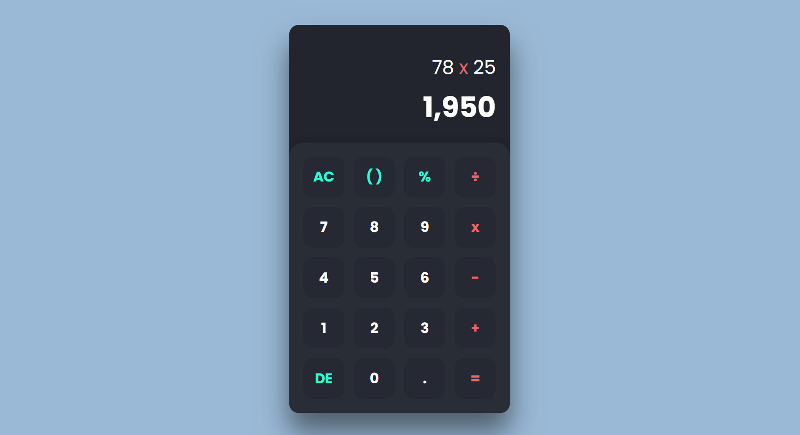

# Modern Calculator

Welcome to the Modern Calculator repository! This project is a sleek and feature-rich calculator built with HTML, CSS, and JavaScript. It comes with a modern UI design for an enhanced user experience.

## Preview



## Features

- **Responsive Design:** Ensures optimal viewing on various devices.
- **Modern UI:** Sleek layout with a user-friendly design.
- **Standard Calculator Functions:** Addition, subtraction, multiplication, division, and more.
- **Scientific Calculator (Optional):** Advanced mathematical functions for complex calculations.

## Getting Started

To run the Modern Calculator locally, follow these steps:

1. Clone the repository to your local machine:

   ```bash
   git clone https://github.com/Devsethi3/Modern-calculator.git
   ```

2. Open the `index.html` file in your preferred web browser.

## Usage

1. Use the on-screen buttons or keyboard to input numbers and perform calculations.
2. Enjoy the modern and intuitive design for an enhanced user experience.

## Customization

Feel free to customize this calculator to fit your preferences. Update styles, colors, and layout in the HTML and CSS files. You can also extend its functionality to include additional features or customize the existing ones.

## Contributing

If you'd like to contribute to this project, please follow these steps:

1. Fork the repository.
2. Create a new branch for your feature or improvement.
3. Make your changes and commit them with descriptive messages.
4. Push your changes to your forked repository.
5. Open a pull request to merge your changes into the main branch.

Explore the Modern Calculator, provide feedback, and consider contributing to its development. Thank you for checking out the repository!